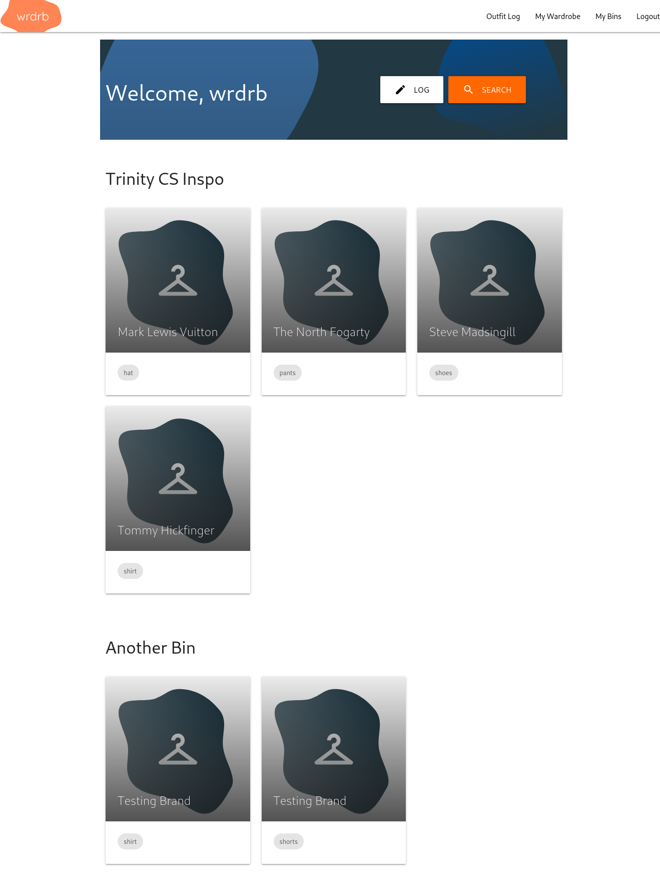

# Wrdrb 👕

Wrdrb is a web app focused on organizing your wardrobe. This repository is home to the demo made by [Tom Lauerman](https://github.com/TempixTL), [Ryan Fernandez](https://github.com/rfernan8), [Lizzie Ruetschle](https://github.com/eruetsch), and [Alex Walker](https://github.com/awalker3) for Trinity's CSCI 3345: Web Applications final project in the Spring of 2021.

Please note that this repository is (indefinitely) a work-in-progress, and has many features implemented only enough for a convincing demo.

## Screenshots 🖼️



## Installation with Docker 🐋

Install Docker (and Docker Compose on Linux) from [the Docker website][ref_docker].

Run the application using Docker Compose.

```sh
docker-compose up
```

View the website at [http://localhost:9000](http://localhost:9000)! 🚀

## Technical Documents 📜

- [Proposal Presentation][doc_1]
- [Preliminary Wireframes][doc_2]
- [Database Schema Diagram][doc_3]
- [Frontend/Backend API Specification][doc_4]
- [Final Presentation][doc_5]

[ref_docker]: https://www.docker.com/
[doc_1]: README/proposal-presentation.pdf
[doc_2]: README/preliminary-wireframes
[doc_3]: README/database-schema-diagram.svg
[doc_4]: https://wrdrb.stoplight.io/docs/wrdrb/reference/Wrdrb-Api.yaml
[doc_5]: README/final-presentation.pdf